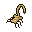
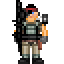
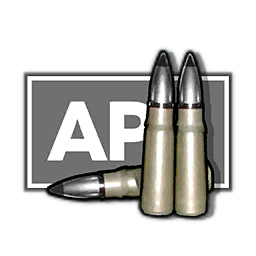

### Try the game

You can find a live version of the game here: https://davidtan.pro/Alien-Raiders/

![live]

### Background

Alien Raiders is a 1-player game inspired by the classic game, Space Invaders.
In Space Invaders, the player starts out at the bottom of the screen while an
army of aliens spawn at the top in a formation. Keep in mind that you will get
more points as the aliens get faster.

#### Setup
To play Alien Raiders, download and webpack this library. This will generate a alien_raiders.js
file which you can find in the lib folder.

To install webpack: `npm install`

After installation, run webpack by using: `npm run ww`

```html
<head>
  ...
  <script type="text/javascript" src="./lib/DOMain.js"></script>
  ...
</head>
```

### Controls

On the page, controls can be found after clicking on the controls text.

Controls

A / ← = Move left

D / → = Move right 

Space = Shoot 

P = Pause/Resume/Start Game

R = Reset Game

### Starting

Initially, press P to start the game at level 1.

Pressing P again will pause the game.

Press R to start all over from level 1 and press P to start the new reset game.

Your score can be seen on the right side of the screen.

Try to see if you can get a high score! The faster the aliens are the more points
you will receive. Pick the powerups that appear to have faster bullets.

### Legends



Alien: Shoot these to gain points. They will travel from left to right and go down
a level each time the side aliens hit the boundary. They become faster as they get
closer to the player.



Player: This is you. You will be moving this character left and right to try to
shoot the aliens before they get to you.



Power up: These powerups are called "Air-Piercing Bullets" that increase your
bullet speed every time the player picks it up. They drop after every completed
level.

[live]:./assets/alienraiders.png