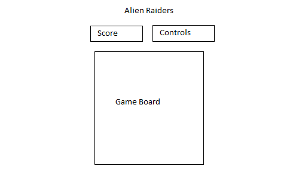

### Background

Alien Raiders is a 1-player game inspired by the classic game, Space Invaders.
In space invaders, the player starts out at the bottom of the screen while an
army of aliens spawn at the top in a formation.

The player's controls are left, right and fire. Upon firing, a projectile will
be created that moves straight upwards. If an alien is hit, the alien disappears.

The objective of the game is for the player to destroy all the aliens
before the aliens touch the player or in some variants, destroy the player
with their own projectiles.

### Functionality & MVP  

The player is able to:
- [ ] Start, pause, and reset the game
- [ ] Move left, right and fire
- [ ] Win and lose the game

### Wireframes
This app will be a single screen with the title displayed at the top, a scoreboard,
controls and the game board. It will also include links to the github, my LinkedIn,
and the About modal. The controls will display the keys to press to set the state
of the game (ex. Start the game) as well as the actions during the game (ex. Moving
  the ship and firing).

### Architecture and Technologies

This project will be implemented with the following technologies:

- Vanilla JavaScript and `jQuery` for overall structure and game logic,
- `Easel.js` with `HTML5 Canvas` for DOM manipulation and rendering,
- Webpack to bundle and serve up the various scripts.

In addition to the webpack entry file, there will be three scripts involved in this project:

`board.js`: this script will handle the logic for the game state and the rendering.
It will hold the score and the state of the game.
`player.js`: this script will handle the logic of the player and controls. It will
hold the position of the player.
`aliens.js`: this script will handle the movement of the aliens. It will house the
constructor of the alien which includes a position and number of points it is worth.

### Implementation Timeline
Day 1: Install and save dependencies such as webpack and Easel.js. Create a package and
webpack config file, respectively named webpack.config.js and package.json.  Write
an entry file and templates for the 3 scripts. Review the basics of HTML5 Canvas.
Goals for the day:
- Get the title and boxes that will contain the items to show up on the screen
- Render a object on the Easel

Day 2:  Build the player class and the logic. Render the player on the board and
ensure the controls are working in that the player is observed to be moving upon
pressing the proper control key. Build the alien class. Render the alien on the
screen so that it can be seen.
Goals for the day:
- Create the player class and be able to render it on the screen
- Get the controls for the player to work
- Build a simple alien class to render on the screen

Day 3: Add the logic for the aliens to start moving. Handle the score on the board.
Get the bullet collision working so that the player can destroy aliens. Get the board
to handle the win and lose conditions.
Goals for the day:
- Add the logic to the aliens to move on the board
- Add the collision detection of aliens and player bullet
- Be able to set the won or lost condition on the board

Day 4: Style the board, alien and player. Control the state of the game with
keyboard presses.
Goals for the day:
- Add icons for the player and aliens other than basic shapes
- Create controls for the game to start, pause and reset

### Bonus features
There are other features that the original space invaders had. These possible
additions are:
- [ ] Have an additional UFO alien at the top appear randomly and shoot at the player
- [ ] Add the ability for regular aliens to shoot randomly downwards towards the player
- [ ] Add walls for the player to hide behind
